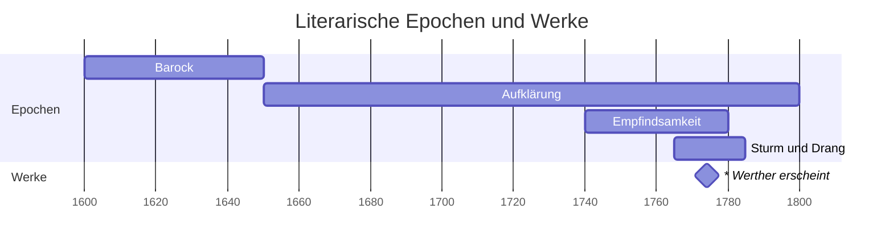
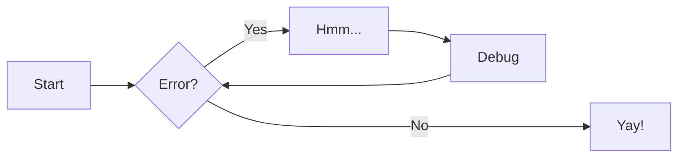

# VL Liebe in der Literaturgeschichte

Liebe lässt sich wissenschaftlich als Kommunikationsphänomen untersuchen. Sie ist nicht nur ein Modus der Interaktion von Menschen, sondern zeichnet sich durch eine spezifische Selbstreflexivität aus: Das liebste Gesprächsthema von Liebenden ist ihre Liebe. So will es zumindest die Literatur, die in allen Epochen und Kulturen Liebende in der Auseinandersetzung mit ihren Gefühlen zeigt – und damit nicht unwesentlich an der Gestaltung von Liebesdiskursen beteiligt ist. 

Am Leitfaden der Liebe als Thema literarischer Texte führt die Vorlesung in die Geschichte der europäischen Literatur von der Antike bis heute ein. Dabei soll ein grundsätzliches Verständnis für Literatur in ihren gesellschaftshistorischen Zusammenhängen, in ihren größeren epochalen Dimensionen und in ihren kulturspezifischen Kontexten vermittelt werden. Zentrale Fragen sind daher die folgenden: Wie werden bestimmte Stoffe und Gattungen über kulturelle und historische Grenzen hinweg bearbeitet und weitergeschrieben? Wie sind solche Epochen und Strömungen miteinander verknüpft und inwiefern bedingen sie sich gegenseitig? In welchem Verhältnis stehen die literarischen Texte zu anderen Künsten und Wissenschaften? Und schließlich, (wie) wirkt die Literatur auf die historische ‚Wirklichkeit’ zurück? 

- [@Harst_2024b]
- [@Harst:2023f]
- @Harst-2024c

> Und er hat auch viele schlaue Sachen gesagt.[^FN]

## Diagramm

{.img-left} 

Dies ist ein Beispieltext, der um das Bild herumfließt.Dies ist ein Beispieltext, der um das Bild herumfließt.Dies ist ein Beispieltext, der um das Bild herumfließt.Dies ist ein Beispieltext, der um das Bild herumfließt.Dies ist ein Beispieltext, der um das Bild herumfließt.Dies ist ein Beispieltext, der um das Bild herumfließt.

---

Dies ist ein Beispieltext, der um das Bild herumfließt.Dies ist ein Beispieltext, der um das Bild herumfließt.Dies ist ein Beispieltext, der um das Bild herumfließt.Dies ist ein Beispieltext, der um das Bild herumfließt.Dies ist ein Beispieltext, der um das Bild herumfließt.Dies ist ein Beispieltext, der um das Bild herumfließt.

## Bibliografie
\bibliography

[^FN]: Referenz in der Fußnote.